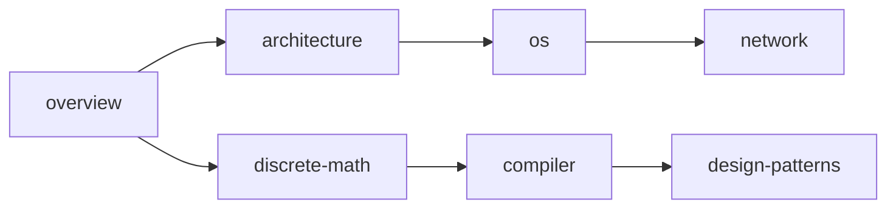

# 计算机科学概述

> @Version: v4.0.0
> @Author: fanquanpp
> @Category: Computer Science / Overview
> @Description: 计算机科学学科全景图，知识体系脉络与核心抽象层级。

---

## 目录

- [1. 学科定义与边界](#1-学科定义与边界)
- [2. 知识体系全景图](#2-知识体系全景图)
- [3. 抽象层级模型](#3-抽象层级模型)
- [4. 三大主线：体系结构 / 协议栈 / 状态机](#4-三大主线体系结构--协议栈--状态机)
- [5. 计算理论的哲学基础](#5-计算理论的哲学基础)
- [6. 本模块的知识依赖图](#6-本模块的知识依赖图)
- [延伸阅读](#延伸阅读)

---

## 1. 学科定义与边界

计算机科学的核心问题不是"计算机是什么"，而是"什么是可计算的"。本节梳理 CS 的学科定义、与数学/工程的边界，以及从图灵机到现代计算模型的演进脉络。

---

## 2. 知识体系全景图

以树状结构呈现 CS 的主要分支：理论计算、体系结构、系统软件、网络与通信、编程语言、算法与数据结构、人工智能。每个分支标注与本书其他模块的映射关系。

```
Computer Science
├── Theory of Computation ──→ discrete-math
├── Computer Architecture ──→ architecture
├── Systems Software ───────→ os, compiler
├── Networking ─────────────→ network
├── Programming Languages ──→ compiler, design-patterns
├── Algorithms & DS ────────→ (贯穿全模块)
└── AI ─────────────────────→ (本模块不覆盖)
```

---

## 3. 抽象层级模型

从晶体管到应用的自底向上分层：物理层 → 数字逻辑层 → 微架构层 → 指令集层 → 操作系统层 → 语言运行时层 → 应用层。本节阐述每一层的接口契约与信息隐藏原理。

---

## 4. 三大主线：体系结构 / 协议栈 / 状态机

本模块以三条主线贯穿所有章节：

- **体系结构主线**：硬件资源如何被组织、寻址、调度
- **协议栈主线**：数据如何在不同抽象层间被封装、传输、解封
- **状态机主线**：动态行为如何被建模为状态转移图

本节给出三条主线的交叉矩阵，说明每个章节由哪些主线驱动。

---

## 5. 计算理论的哲学基础

可计算性、停机问题、丘奇-图灵论题。本节提供理论地基，为后续编译原理（可判定性）和离散数学（形式语言）建立前置认知。

---

## 6. 本模块的知识依赖图

以有向无环图（DAG）呈现各章节间的前置依赖关系，指导阅读顺序。



---

## 延伸阅读

- *The Computer Science and Engineering Handbook* — Tucker
- *Introduction to the Theory of Computation* — Michael Sipser
- *Computer Science: An Overview* — J. Glenn Brookshear
