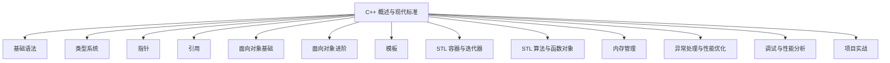

## 知识地图

```mermaid
graph TD
    A[C++ 概述与现代标准] --> B[基础语法]
    A --> C[类型系统]
    A --> D[指针]
    A --> E[引用]
    A --> F[面向对象基础]
    A --> G[面向对象进阶]
    A --> H[模板]
    A --> I[STL 容器与迭代器]
    A --> J[STL 算法与函数对象]
    A --> K[内存管理]
    A --> L[异常处理与性能优化]
    A --> M[调试与性能分析]
    A --> N[项目实战]
```
