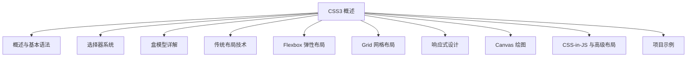

## 知识地图

```mermaid
graph TD
    A[CSS3 概述] --> B[概述与基本语法]
    A --> C[选择器系统]
    A --> D[盒模型详解]
    A --> E[传统布局技术]
    A --> F[Flexbox 弹性布局]
    A --> G[Grid 网格布局]
    A --> H[响应式设计]
    A --> I[Canvas 绘图]
    A --> J[CSS-in-JS 与高级布局]
    A --> K[项目示例]
```
