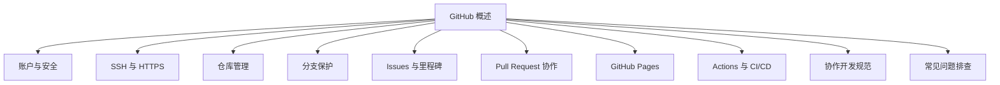

## 知识地图

```mermaid
graph TD
    A[GitHub 概述] --> B[账户与安全]
    A --> C[SSH 与 HTTPS]
    A --> D[仓库管理]
    A --> E[分支保护]
    A --> F[Issues 与里程碑]
    A --> G[Pull Request 协作]
    A --> H[GitHub Pages]
    A --> I[Actions 与 CI/CD]
    A --> J[协作开发规范]
    A --> K[常见问题排查]
```
