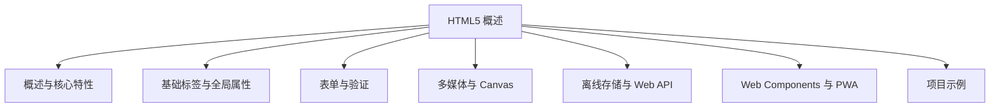

## 知识地图

```mermaid
graph TD
    A[HTML5 概述] --> B[概述与核心特性]
    A --> C[基础标签与全局属性]
    A --> D[表单与验证]
    A --> E[多媒体与 Canvas]
    A --> F[离线存储与 Web API]
    A --> G[Web Components 与 PWA]
    A --> H[项目示例]
```
