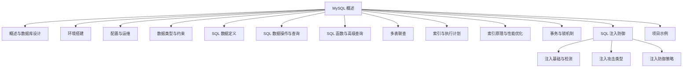

## 知识地图

```mermaid
graph TD
    A[MySQL 概述] --> B[概述与数据库设计]
    A --> C[环境搭建]
    A --> D[配置与运维]
    A --> E[数据类型与约束]
    A --> F[SQL 数据定义]
    A --> G[SQL 数据操作与查询]
    A --> H[SQL 函数与高级查询]
    A --> I[多表联查]
    A --> J[索引与执行计划]
    A --> K[索引原理与性能优化]
    A --> L[事务与锁机制]
    A --> M[SQL 注入防御]
    M --> M1[注入基础与检测]
    M --> M2[注入攻击类型]
    M --> M3[注入防御策略]
    A --> N[项目示例]
```
